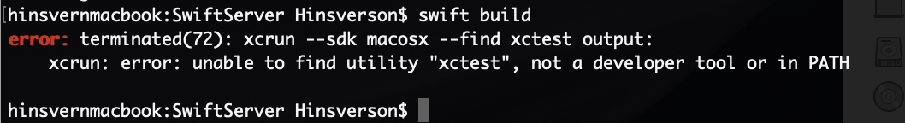
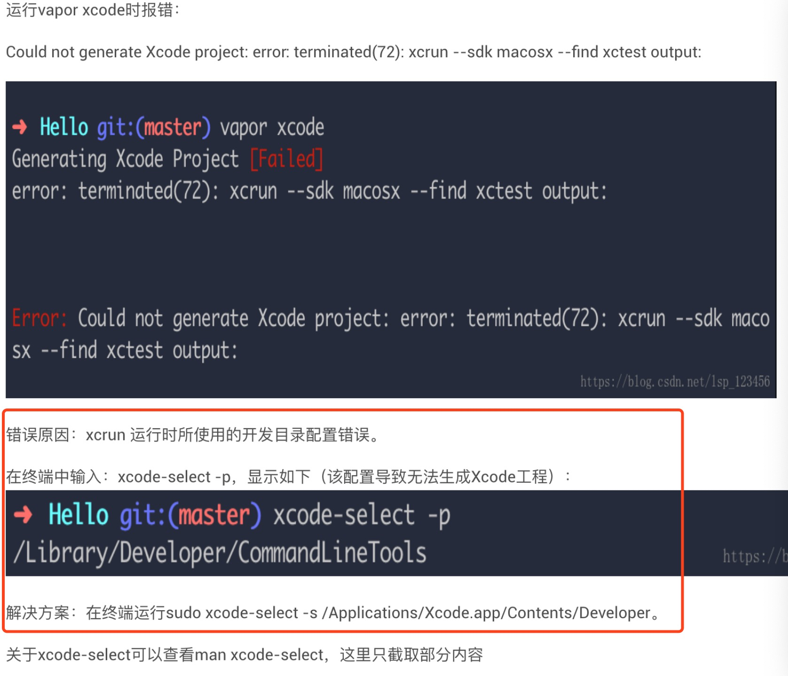

# spm
#Swift/服务端

swift package generate-xcodeproj
后需要重新设置
$(PROJECT_DIR) - Recursive

[如何使用Swift Package Manager - 简书](https://www.jianshu.com/p/d75c1752955a)

vi ./.bash_profile

source ./.bash_profile

问题：

```
error: terminated(72): xcrun —sdk macosx —find xctest output:
    xcrun: error: unable to find utility “xctest”, not a developer tool or in PATH
```

解决办法：

