# AutoLayout
#iOS知识点/UI相关

[Auto Layout 的 总结小册 - 掘金](https://juejin.im/post/6844903949862977544#heading-21)
	
# AutoLayout优化点
1. 不要写重复的约束和无用的约束。
2. 不要频繁添加移除约束，尽量在有需要的时候更新。
3. 不需要的场景下Override intrinsicContentSize 来固定UILabel的size，避免大量计算提高性能。
4. 少使用systemLayoutSizeFittingSize通过布局引擎获取size，因为它每次调用都会创建和销毁一个布局引擎，比较消耗性能。
5. 批量和快速更新可约束写在View的updateConstraints里。
6. 以下刷新layout的方式性能从高到低：（待验证）
	1. 把 view 添加到当前 window 上，更新约束后调用 layoutIfNeeded刷新布局计算。
	2. 调用systemlayoutFitSize获取布局后的size。
	3. view 没有并添加到 window 上，更新约束后调用 layoutIfNeeded 的数据。

[深入理解 Autolayout 与列表性能 — 背锅的 Cassowary 和偷懒的 CPU - 掘金](https://juejin.im/post/6844903700922630151)
[使用Autolayout对多行文本Label进行布局，高度不准确的解决办法！_weixin_33704591的博客-CSDN博客](https://blog.csdn.net/weixin_33704591/article/details/88001993)
[WWDC 2018：高性能 Auto Layout - 掘金](https://juejin.im/post/6844903619360194568#heading-4)

# Aulayout原理
基于Cassowary算法的，苹果在此基础上提供了一套Layout Engine引擎，由它来管理页面的布局，来完成创建、更新、销毁等。
通过相对布局的方式，行成一个多元一次方程组，由Layout 引擎完成计算求解。求出的解集在 UIView 渲染过程中，当做其 frame 属性中的值来使用。
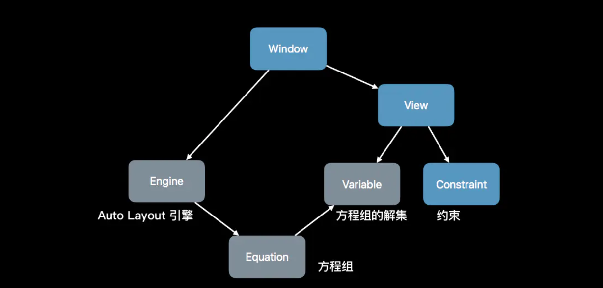

# 理解自动布局刷新循环
[自动布局 Auto Layout (原理篇) - 简书](https://www.jianshu.com/p/3a872a0bfe11)
Auto Layout布局过程涉及延迟机制，并非一有约束更新就马上进行布局重绘，当有约束更改时，系统的默认做法是延迟更新，目的是实现批量更改约束、绘制视图，避免频繁遍历视图层级，优化性能。当更新约束太慢影响到后序代码逻辑，也可强制马上更新。

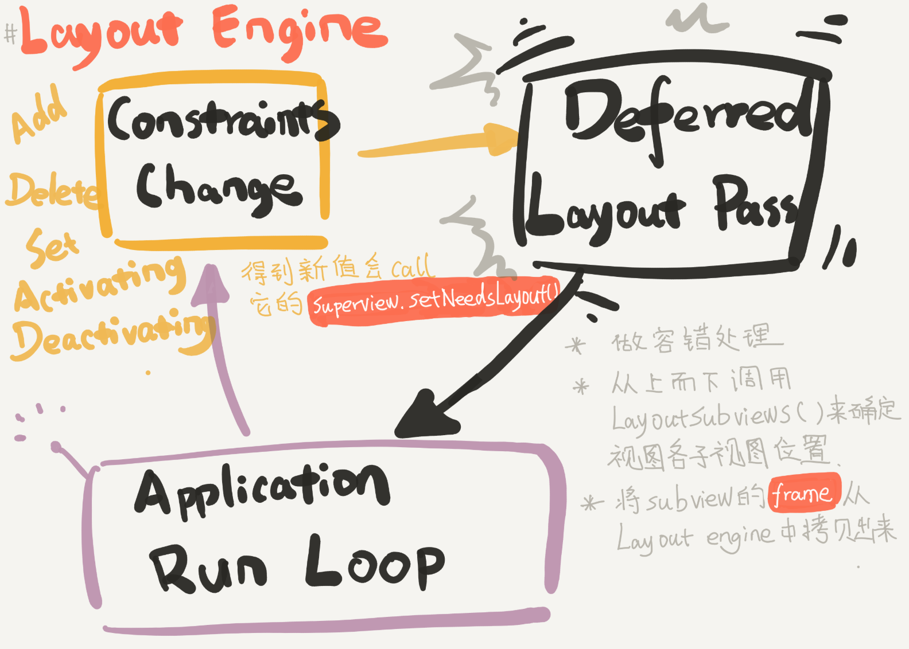
1. App启动后开启RunLoop，会开启一个常驻线程来循环检测图层树中是否存在约束变化，约束变化后的视图会被打上setNeedsUpdateConstraints标记，在本次runloop即将休眠时会首先从子到父节点的顺序进行updateConstraints约束的更新处理。
2. 更新完约束后，Layout Engine 会重新计算新的frame并存起来，并发出通知，给本次位置、尺寸发生改变的所有视图中最顶层视图的父视图打上NeedLayout标记，调用被标记为NeedLayout视图的layoutSubviews方法。
3. 然后从父到子的顺序，从Layout Engine中取出更新后的frame值，依次确定所有子视图的位置大小。

**注意点**
1. 约束改变后是所有frame变化视图树上最高的那个视图的父视图被打上setNeedLayout()
2. layoutSubviews：
	1. 如果使用自动布局时，又重写这个方法又不调用super，那么自动布局会失效。
	2. 更新的是子视图的frame、size。
	3. 如果想要invalidate子视图的布局，需要在调用super的实现之前。
	4. 不要在此调用setNeedsUpdateConstraints，因为update constraints pass已经过了，在此调用为时已晚。
	5. 该方法只应该对子视图树负责，操作子视图树以外的视图可能会造成循环布局。
3. 约束必须添加到该约束相关的视图所在的视图树的第一个公共祖先(第一个公共superView)
4. updateConstraints使用场景理解：批量处理约束的更新（更快，更高效）
	1. 当约束更新过慢时可以在此方法中更新约束，得益于批处理，在此更新会比较快（实际上我们更常用layoutIfNeed强制立即布局）
	2. 约束需要频繁更新时，可以统一在updateConstraints方法中进行更新逻辑的处理，否则一般固定的约束写在viewdidload里。 

# 理解布局、渲染刷新机制
[译 揭秘 iOS 布局](https://juejin.cn/post/6844903567610871816) 很全面的介绍
[WWDC 2018：高性能 Auto Layout - 掘金](https://juejin.im/post/5b1ea5046fb9a01e2b2cc4a7#heading-3)
https://www.xuyafei.cn/post/public/autolayout-layout
[关于layoutSubviews的调用时机](https://juejin.cn/post/6844903897073451022)
[updateConstraints的理解](https://www.jianshu.com/p/b7f42327a8dd)
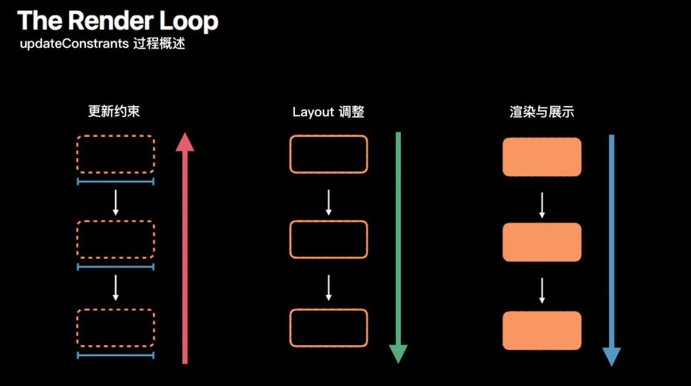
``` swift
/// Render Loop 过程
/// 过程一：Constraints 更新 从下到上(子到父)
func updateConstraints();
func setNeedsUpdateConstraints();
func updateConstraintsIfNeeded(); //立即刷新

/// 过程二：Layout 调整 从上到下（父到子）
func layoutSubviews();
func setNeedsLayout();
func layoutIfNeeded(); //立即刷新

/// 过程三：渲染与展示 从上到下
func draw(_:);
func setNeedsDisplay();
```

# 一些布局理解
## 优先级
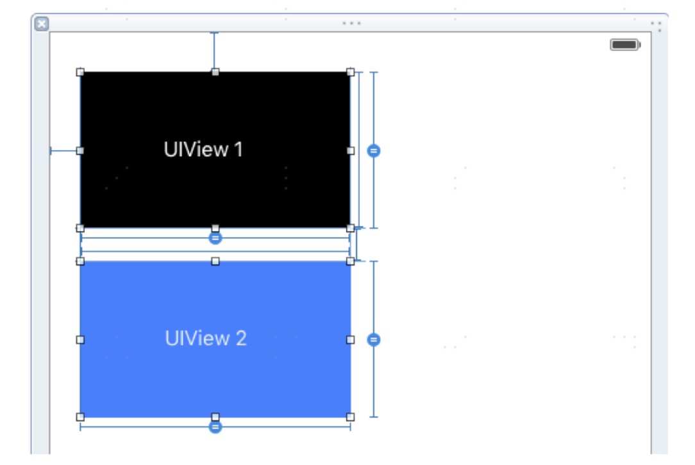
一般来解决模糊约束的冲突的问题，比如view2的宽高约束本来equal view1，origin也确定，但是又想view2的宽不能一致跟着view1走，而是最大为50，于是给UIView2加上一条约束：宽度<=50。这时候当view1的宽小于50时不会存在冲突，但是大于50就会和原来的equal宽的约束冲突。

**解决办法就是设置equal宽约束的优先级比宽度<=50的这条约束低。**

## systemLayoutSizeFittingSize
返回Auto Layout后内容高度，内部会创建一个布局引擎用于计算，比较耗性能，应该少用。
``` objc
- (CGSize)systemLayoutSizeFittingSize:(CGSize)targetSize NS_AVAILABLE_IOS(6_0); 
- (CGSize)systemLayoutSizeFittingSize:(CGSize)targetSize withHorizontalFittingPriority:(UILayoutPriority)horizontalFittingPriority verticalFittingPriority:(UILayoutPriority)verticalFittingPriority NS_AVAILABLE_IOS(8_0);
```

## Intrinsic Content Size
[只有20%的iOS程序员能看懂：详解intrinsicContentSize 及 约束优先级／content Hugging／content Compression Resistance_hard_man的专栏-CSDN博客](https://blog.csdn.net/hard_man/article/details/50888377)
对于文本/图片等一些视图控件，可以通过其内在content推算出控件的大小，按钮,文本label,文字输入TextField,TextView,ImageView都可以根据内在的content内容计算控件的大小，从而布局时自带size。
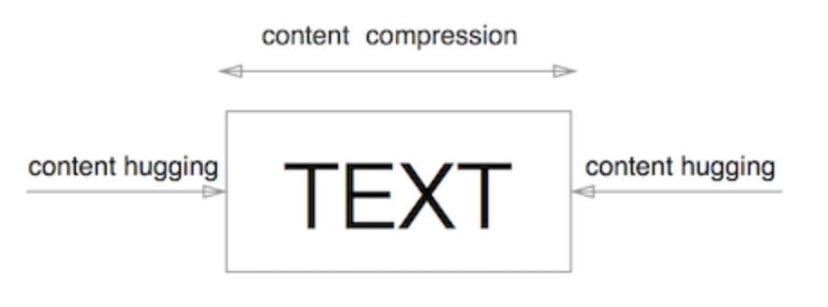
原理：一个多行文字的 label 给一个宽度约束，然后设置 text，会触发自有size的变化，而IntrinsicContentSize变化后，Autolayout 都会创建两个新的
NSContentSizeLayoutConstraint约束分别约束宽和高，添加到
NSISEnginer中求解，而不是直接更新已经创建好的约束，所以IntrinsicContentSize还是比较影响性能，应该尽量少用（说是可以少用，其实不符合实际的扯淡）。

## content Hugging和content Compression
这2个的使用场景在于多个拥有Intrinsic Content Size的控件在做布局时，调整被拉开和压缩的优先级顺序关系。
### 举例：Content Hugging 解决拉伸
红label约束:上0,左0,右0
绿label约束:上0,左0,右0,下0
**存在问题：这2个label都是动态高度(未添加高度约束)**
当2个label总高度小于父view高度时,AutoLayout不知道优先拉伸哪个label.
当2个label总高度大于父view高度时,AutoLayout不知道优先压缩哪个label.
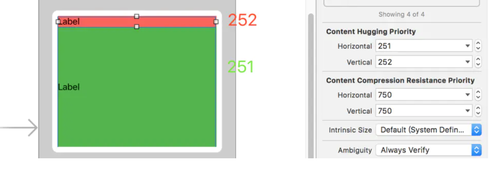
**修改Content Hugging Priority 来解决小于时不知道拉伸谁的问题：**
红label: vertical: 252，绿label: vertical: 251
### 举例：Content Compression 解决压缩
红label约束:上0,左0,下0
绿label约束:上0,左0,下0,右0
**存在问题：这2个label都是动态宽度,宽度由文字（Intrinsic Content Size）多少决定**
当这2个label实际宽度之和小于父view宽度时，AutoLayout不知道优先拉伸哪个label。
当这2个label实际宽度之和大于父view宽度时，AutoLayout不知道优先压缩哪个label（文字很长的情况）。
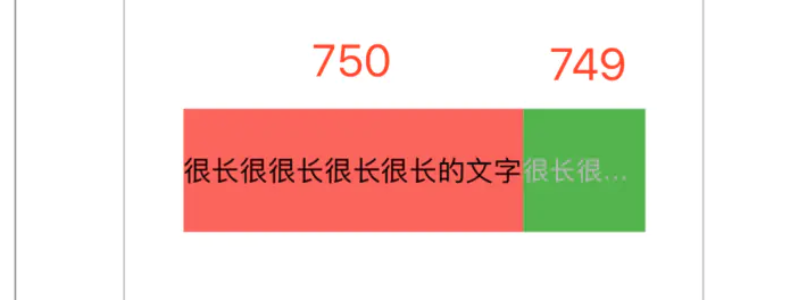
**修改 Content Compression Resistance 解决文字很长不知道压缩谁的问题：**
红label: Horizontal: 750，绿label:  Horizontal: 749

# 常用布局技巧
[iOS AutoLayout进阶(五)UITableViewCell自动高度 - 掘金](https://juejin.im/post/5a31ddba51882504a35efcb5)[- 掘金](https://juejin.im/entry/6844903715548168200)

### 如何撑开父视图
撑开的理解就是内部是能确定宽高和位置的，然后和外部视图的edges都有绝对的约束，所以可以撑开外部view。
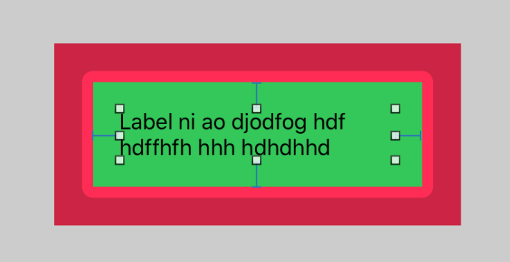
1. 红色view：设置LRT约束，高度不用设置死（或者less，greater）
2. 绿色view：设置LRTB到红色的约束
3. label：设置LRTB到绿色的约束
4. 因为label行数为0时，会自动计算自己的大小，所以会自动撑开父视图。

### 如何撑开父视图的同时处理动态高度和宽度的问题
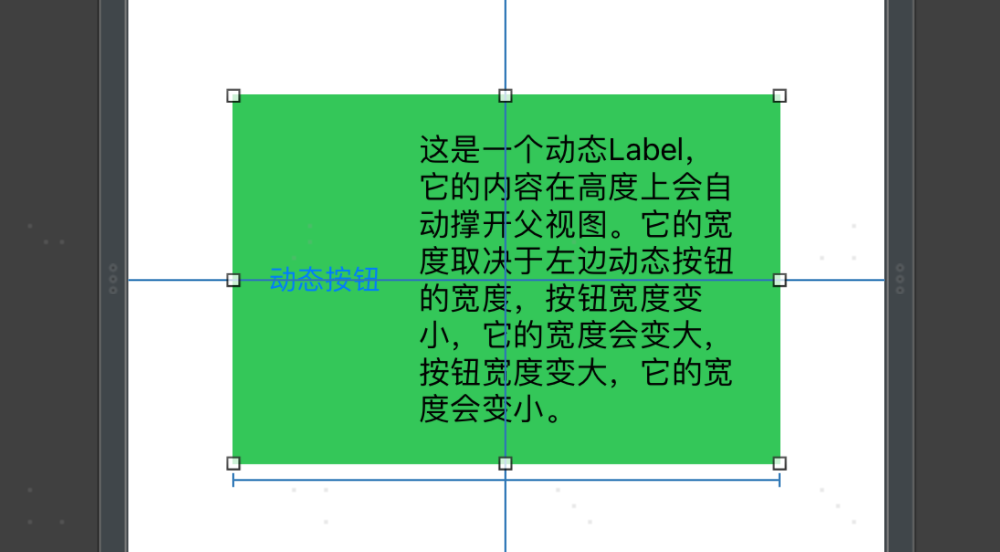
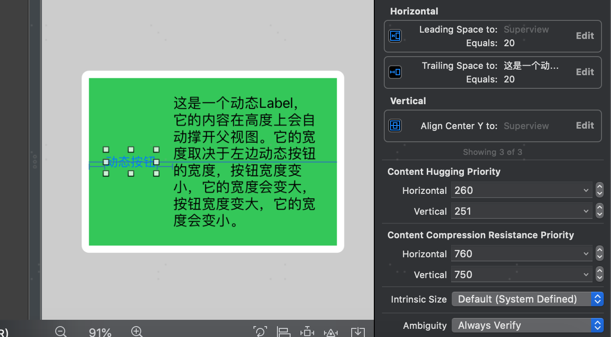
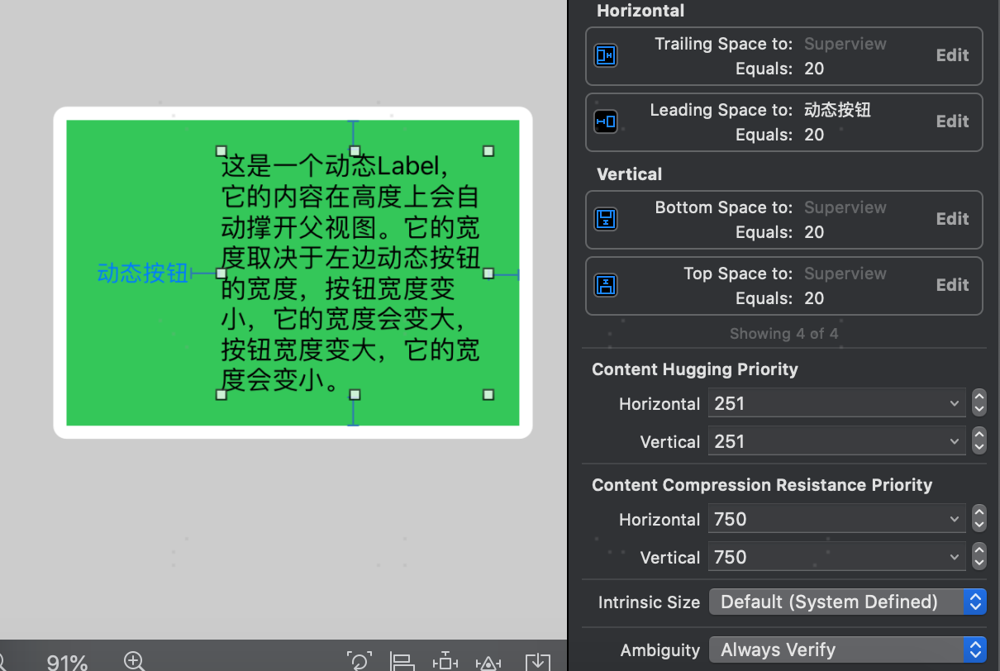

### TableViewCell动态高度
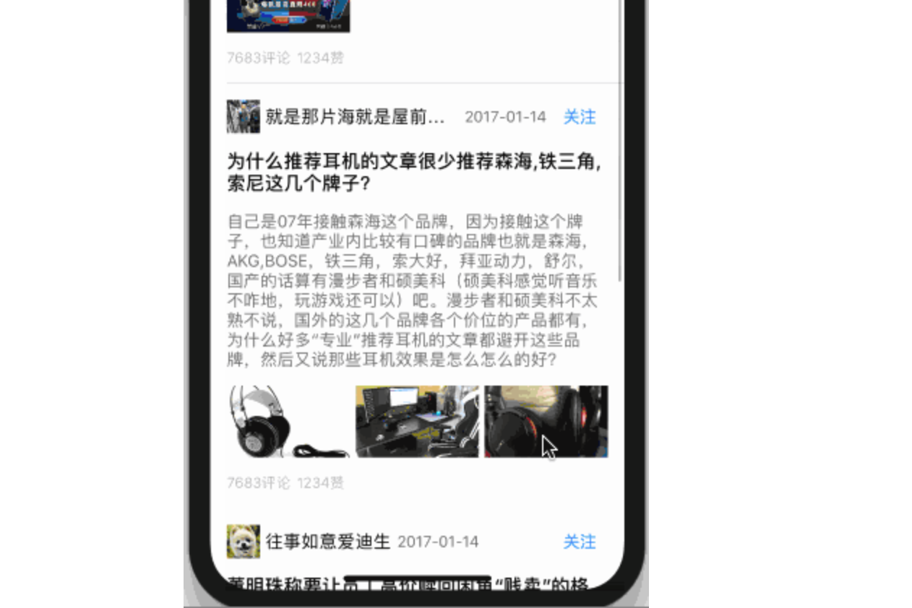
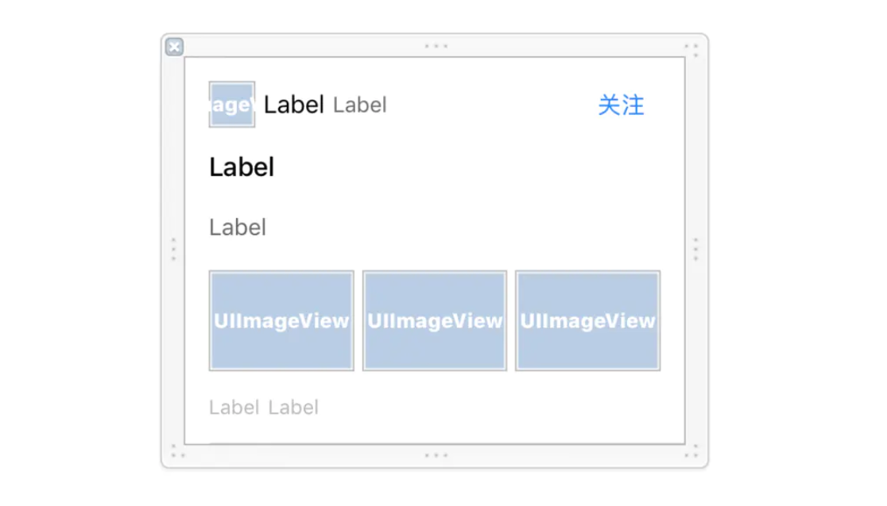
动态高度的点是希望内容部分-contentLab根据内容多少实现动态性，还是撑开的思想，具体可如下设置：
	* 图像-iconView约束:上15,左15,高30,宽高比1:1 
	* 名字-nameLab约束:上下均对其iconView,左5, 并设置横向抗压缩优先级为749即Content Compression Resistance Priority - Horizontal:749
	* 时间-timeLab约束:上下均对齐iconView,左5, 并设置横向抗拉伸优先级为250即Content Hugging Priority - Horizontal:250
	* 关注按钮约束:上下均对齐iconView,右15,宽度50,左5
	* 标题-titleLab约束:左15,上15,右15,
	* 内容-contentLab约束:左15,上15,右15,并设置并设置纵向抗拉伸优先级为250即Content Hugging Priority - Vertical:250
	* 三张图约束:上15,左15,右15,中间间隙5,高度65,并设置三张图等宽,
	* 评论数-commentLab约束:上15,左15,下15,
	* 点赞数-praiseLab约束:上下对齐commentLab,左5,右边15,并设置横向抗拉伸优先级为250即Content Hugging Priority - Horizontal:250

**另外UITableView只需要做如下设置：**
``` objectivec
//cell预估高度,设一个接近cell高度的值
self.tableView.estimatedRowHeight = 100;//也可以省略不设置,
//设置rowHeight为UITableViewAutomaticDimension,
self.tableView.rowHeight = UITableViewAutomaticDimension;//可以省略不设置

/**
-(CGFloat)tableView:(UITableView *)tableView heightForRowAtIndexPath:(NSIndexPath *)indexPath{
    //不实现或return UITableViewAutomaticDimension;//动态高度
}
*/
-(CGFloat)tableView:(UITableView *)tableView heightForRowAtIndexPath:(NSIndexPath *)indexPath{
    if(indexPath.section==0){
        return 100;//固定高度
    }else{
        return UITableViewAutomaticDimension;//动态高度
    }
}
```

**关于组头、组尾也可以实现动态**
``` objectivec
 _tableView.sectionHeaderHeight = UITableViewAutomaticDimension;
_tableView.estimatedSectionHeaderHeight = 100;//组头预估高度
        
_tableView.sectionFooterHeight = UITableViewAutomaticDimension;
 _tableView.estimatedSectionFooterHeight = 100;//组尾预估高度

/**
-(CGFloat)tableView:(UITableView *)tableView heightForFooterInSection:(NSInteger)section{
    //不实现
}
 */

/**
-(CGFloat)tableView:(UITableView *)tableView heightForHeaderInSection:(NSInteger)section{
    //不实现
}
 */
```

## 如何压间距
Wallet的首页布局、红包布局

### iOS 11之后适配刘海屏
* safeAreaLayoutGuide：是UIView的一个只读属性，它继承UILayoutGuide，有layoutFrame意味着它能代表一块区域，它代表的区域避开了诸如导航栏、tabbar或者其他有可能挡住你这个UIView对象显示的所有父view，意味着你的view对象只要相对另一个view的safeLayoutGuide做布局就不用担心她被奇奇怪怪的东西挡住。对于控制器的view的safeAreaLayoutGuide，他的区域同样避开了statusbar或其他有可能挡住view显示的东西，我们甚至可以用控制器的additionalSafeAreaInsets属性，来额外指定inset，如果view完全在父view的安全区域内，或者view不在视图层级或屏幕上，那么view的safeAreaLayoutGuide区域其实和view自身是一样大。
* safeAreaInsets：afeAreaLayoutGuide就是根据safeAreaInsets来调整自己的bounds，它的变化通过viewSafeAreaInsetsDidChange函数通知出来（UIViewController和View都有），调用时机很早，在viewWillAppear后，所以如果需要获取正确的safeAreaInsets最好在viewDidLayoutSubviews时。