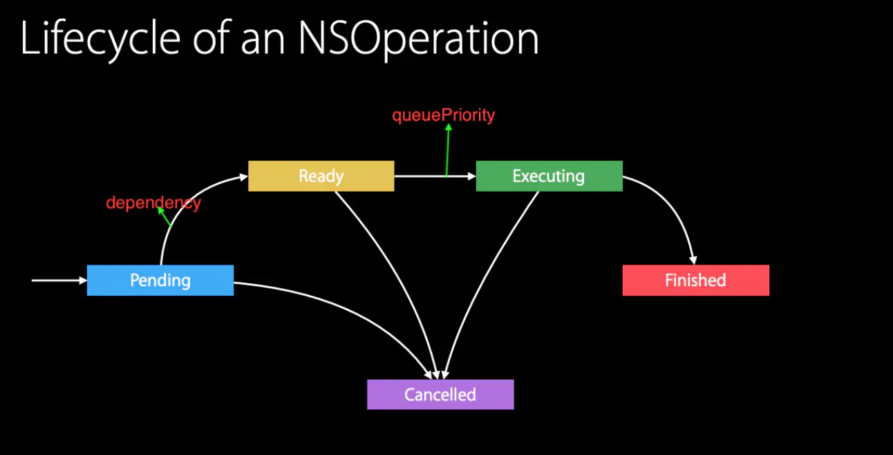
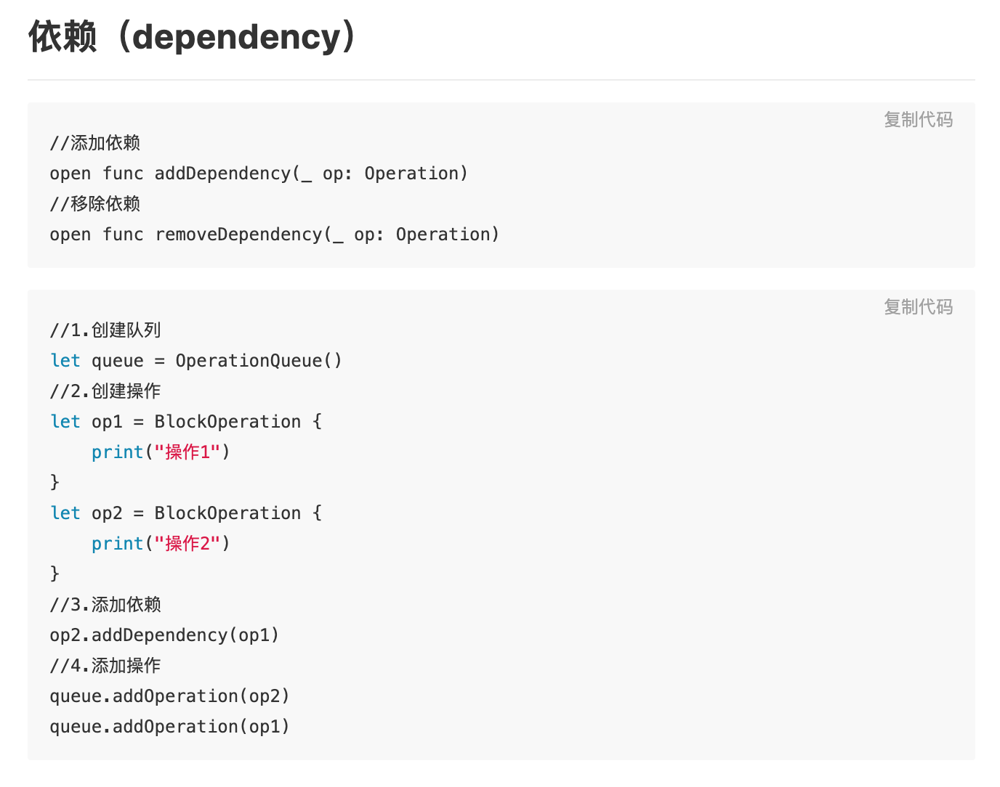
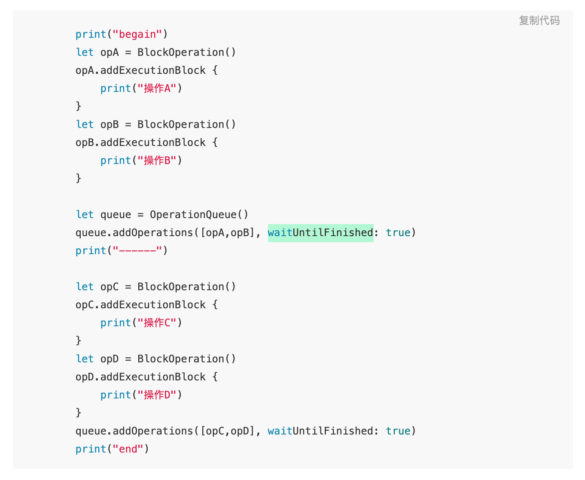
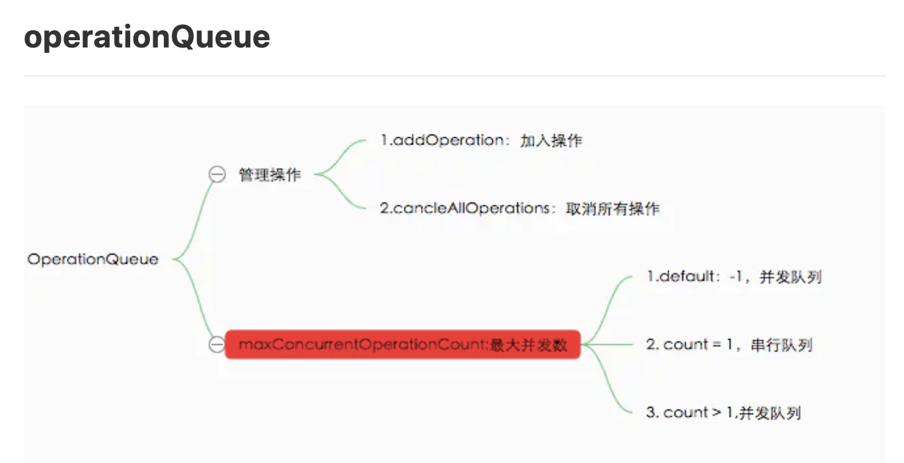
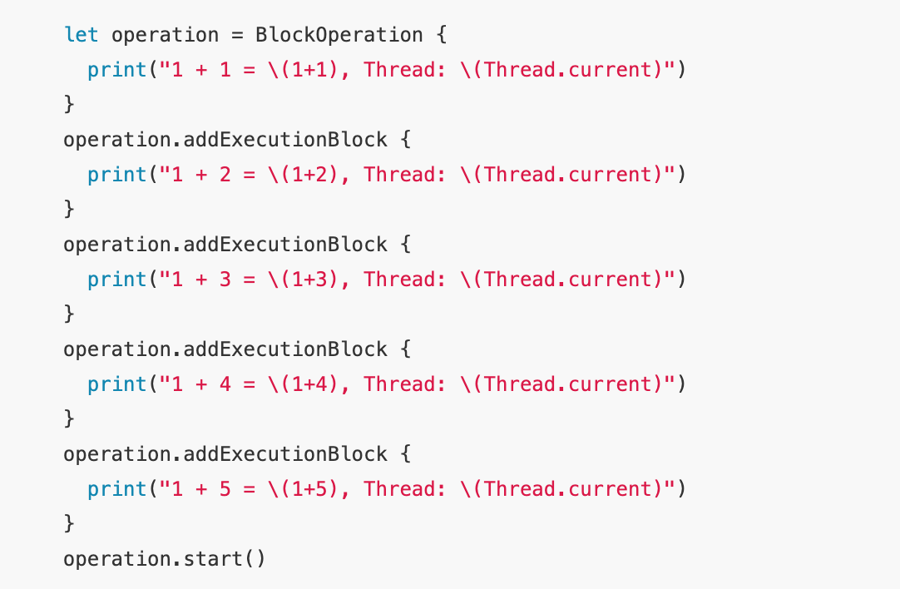
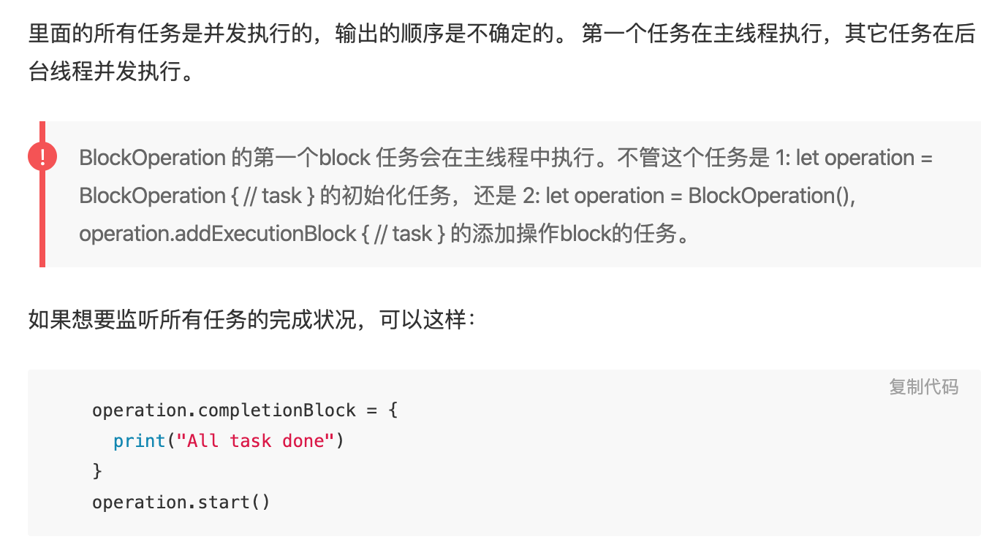
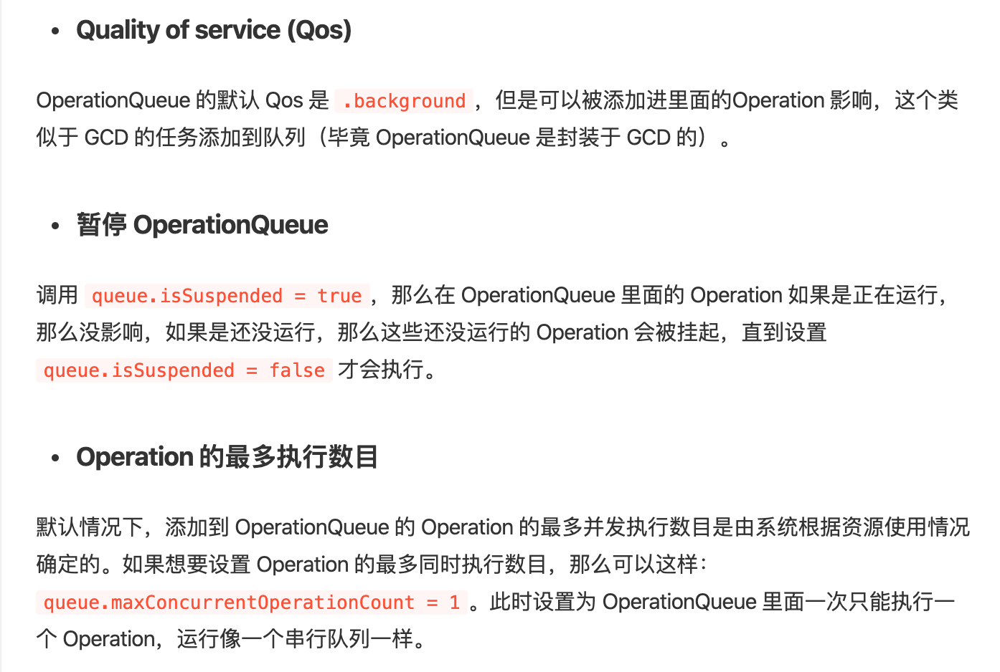

# OperationQueue
#iOS知识点/多线程

[深入浅出 iOS 并发编程](https://mp.weixin.qq.com/s/ut98-V-HU_vXz5O3CXFS2w)

**其拥有暂停、继续、终止等多个可控状态，从而可以更加灵活得适应并发编程的场景** 。

[多线程：Operation和OperationQueue - 掘金](https://juejin.im/post/6844903715892101128)

let operation = Operation() 此时处于Pending状态
**依赖**添加完会进入Ready阶段。此时操作对象会进入**准备就绪状态**。
**优先级**设置之后会进入执行阶段。queuePriority属性决定了**进入准备就绪状态下的操作**之间的开始执行顺序。
完成之后会finished，并且有回调。
完成之后的不能取消，取消可以在其他三个时刻。

op2依赖于op1时，不管添加操作的顺序如何，结果都是op1先执行，op2再执行。不能相互依赖，会造成操作死锁。

AB完成后执行CD

maxConcurrentOperationCount控制最大并发数量，默认为-1并发。

Block的第一个Block任务在主线程执行，其他在后台线程中执行。

Thread Sanitizer
