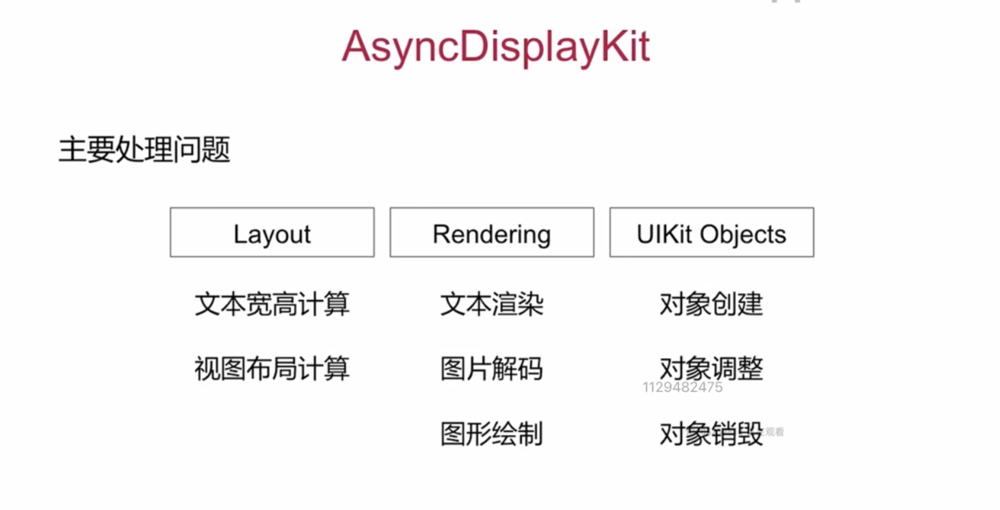
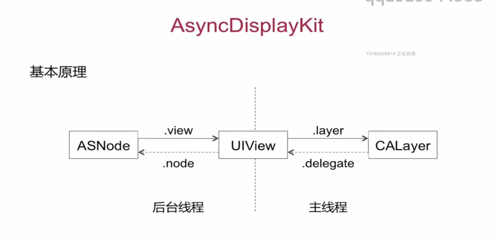
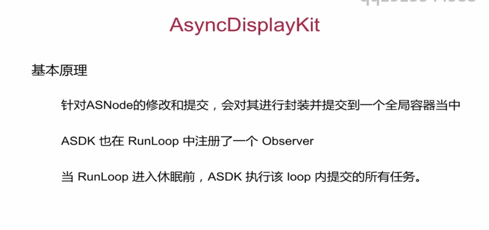

# AsyncDiaplayKit
#iOS知识点/第三方库

 [https://blog.ibireme.com/2015/11/12/smooth_user_interfaces_for_ios/](https://blog.ibireme.com/2015/11/12/smooth_user_interfaces_for_ios/) 

# 主要处理问题
布局计算、文本渲染图形解码和绘制、对象的创建销毁和调整。

文本和布局的计算、渲染、解码、绘制都可以通过各种方式异步执行，但 UIKit 和 Core Animation 相关操作必需在主线程进行。ASDK 的目标，就是尽量把这些任务从主线程挪走，而挪不走的，就尽量优化性能。

# 基本原理
以UIView对Layer的形式，实现了一个Node和View之间的联系，把相关影响性能操作尽量放到子线程，最后在主线程更新。

ASDK 为此创建了 ASDisplayNode 类，包装了常见的视图属性（比如 frame/bounds/alpha/transform/backgroundColor/superNode/subNodes 等），然后它用 UIView->CALayer 相同的方式，实现了 ASNode->UIView 这样一个关系。

