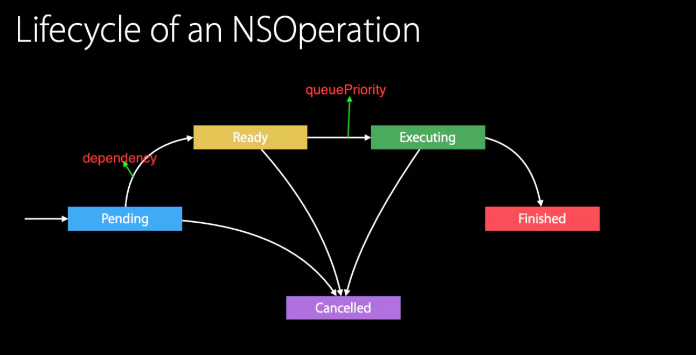
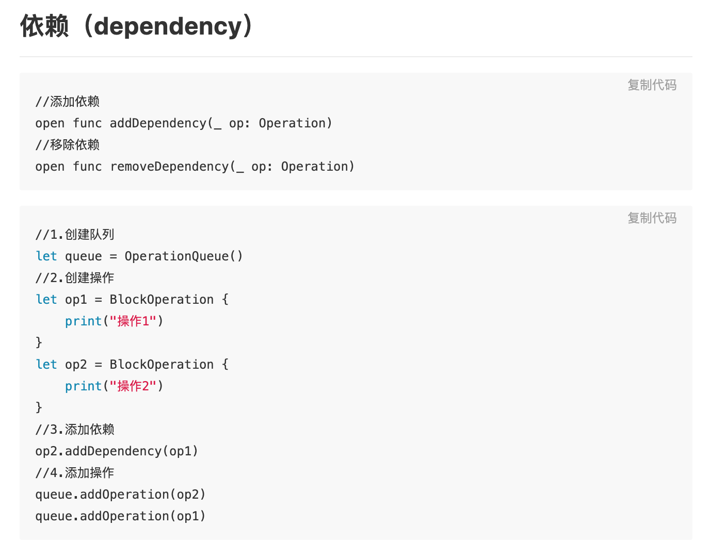
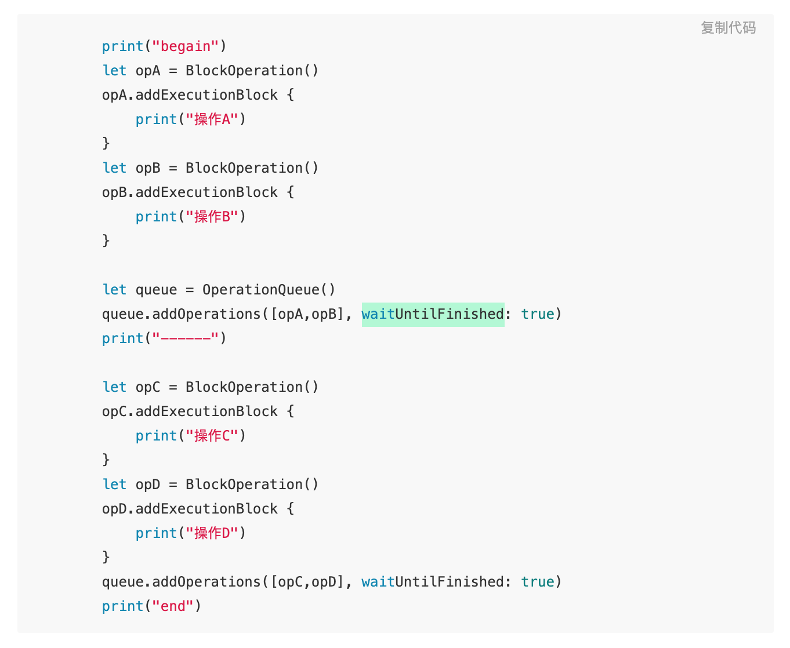

# OperationQueue

[iOS NSOperation & Queue 官方文档学习 - 云+社区 - 腾讯云](https://cloud.tencent.com/developer/article/1365846)
[【译】iOS NSOperation、NSBlockOperation、NSInvocationOperation、NSOperationQueue官方文档](https://juejin.cn/post/6919421089911144462#heading-22)
[iOS 并发：从 NSOperation 和 Dispatch Queues 开始 | Swift 教程 - Swift 语言学习 - Swift code - SwiftGG 翻译组 - 高质量的 Swift 译文网站](https://swift.gg/2016/01/08/ios-concurrency-getting-started-with-nsoperation-and-dispatch-queues/)
[多线程：Operation和OperationQueue - 掘金](https://juejin.im/post/6844903715892101128)

[深入浅出 iOS 并发编程](https://mp.weixin.qq.com/s/ut98-V-HU_vXz5O3CXFS2w)
[NSOperationQueue的注意点 | Voyager-1](https://alanli7991.github.io/2018/06/04/NSOperation%E5%92%8CNSOperationQueue%E7%9A%84%E5%9F%BA%E7%A1%80%E7%94%A8%E6%B3%95/)
[Operation和OperationQueue详解_架构师易筋-CSDN博客](https://blog.csdn.net/zgpeace/article/details/103133287)

[【译】iOS《Concurrency Programming Guide-Operation Queues》官方文档](https://juejin.cn/post/6923122112894861326)
GCD的更面向对象的并发抽象，注意和GCD比，它不是严格的FIFO的，dispatch queue中的block会按照FIFO的顺序去执行，OperationQueue会根据Operation的状态(是否Ready)以及优先级、依赖来确定开始执行Operation的顺序。

# 生命周期和执行过程理解

OperationQueue对于添加到队列中的operation进行执行的自动管理，依据就是：
	1. operation被加入后为pending状态。
	2. 然后进入准备就绪的状态，就绪状态取决于操作之间设置的依赖关系（operation互相依赖关系的设置，在分别添加到多个queue中依然有效），A依赖B的话，A需要在B为finished后才会进入ready状态。
	3. 然后进入就绪状态的操作（isReady == true）会按照自身的优先级从queue中取出调用start进行执行（注意只是优先拿出来，非最终结束态的优先执行完成，如果要保证A在B之后执行，这种应该去设置依赖而不是优先级）
	4. 操作完成或者canceed之后最终operation会finished，然后才会从queue中移除（被添加到queue中的operation无法手动移除），并且有回调，完成之后的不可取消（会报错），取消可以在其他三个时刻。

# OperationQueue总结
在多个线程中使用的单个 NSOperationQueue 对象是线程安全的，无需创建其他锁来同步对该对象的访问。

OperationQueue使用 Dispatch 框架来启动其中Operation的执行。无论Operation被实现为同步还是异步，操作始终在单独的线程上执行，也就是说对当前线程来讲是异步的，当前线程不等待这些operation执行完，而是立即返回移交控制权开始当前线程的后续执行（注意OperationQueue.main除外，OperationQueue.main添加的Operation肯定在主线程执行）。

一个Operation只能最多被添加到一个OperationQueue中，不能重复添加addOperation是默认异步的添加并立即返回移交控制权，addOperations:waitUntilFinished:true是同步的会阻塞当前线程，直到所有指定的操作完成执行。

cancelAllOperations的本质是调用所有排队和正在执行的Operation的cancel方法，cancel的细节参考operation的cancel总结。

waitUntilAllOperationsAreFinished会阻塞当前线程，直到所有都已排队并且正在执行的操作完成为止。在这段时间内，当前线程无法向队列添加操作，但是其他线程可以。所有Operation执行完后会立即返回。如果队列中没有任何操作，则此方法立即返回。

qualityOfService指定应用于添加到队列的操作对象的 service level。如果操作对象设置了显式 service level，则使用该值。这个东西影响操作对象访问系统资源（如 CPU 时间、网络资源、磁盘资源等）的优先级。具有更高 quality of service level 的操作比系统资源具有更高的优先级，因此它们可以更快地执行任务。你使用 service levels 来确保响应显式用户请求的操作优先于不太关键的工作。

suspended指示队列是否正在积极调度要执行的操作。默认为false，将此属性设置为 YES 可防止队列启动任何排队操作，但已执行的操作将继续执行。你可以继续将操作添加到挂起的队列中，但在将此属性更改为 NO 之前，不会计划安排执行这些操作，同时这些未被安排执行的操作也不会被移除，移除永远是finished之后。

underlyingQueue主要用来让Operation散布在特定的dispatchQueue的 执行blocks 中。注意：
仅当队列中没有操作时才应设置此属性的值，否则会报错
不能设置为主队列

addBarrierBlock主要作用类似于 dispatch_barrier_async 函数，当 NSOperationQueue 所有已经入队操作finished时，addBarrierBlock: 方法将执行该块，并阻止任何后续操作被执行，直到 barrier block 完成为止。

progress属性表示队列中执行的操作的总进度。默认情况下，在设置进度的 totalUnitCount 之前，NSOperationQueue 不会报告进度。设置进度的 totalUnitCount 属性后，队列将选择参与进度报告。启用后，对于在 main 结束之前完成的操作，每个操作将为队列的总体进度贡献 1 个完成单位（重写 start 且不调用 super 的操作不会对进度有所贡献）。更新进度的 totalUnitCount 时，应特别注意比赛条件，并应注意避免“落后进度”。例如：当 NSOperationQueue 的进度为 5/10，表示已完成 50％，并且有 90 多个操作要添加时，totalUnitCount 将使进度报告为 5/100，表示 5％。在此示例中，这意味着任何进度条都将从显示 50％ 跳回到 5％，这可能是不希望的。在需要调整 totalUnitCount 的情况下，建议通过使用 addBarrierBlock: API 来实现此目的，以确保线程安全。这样可以确保不会发生意外的执行状态，从而可以适应潜在的向后移动进度方案。

# Operation总结
具有依赖关系的操作对象，在其所有依赖操作对象完成执行之前，不会被视为ready就绪。NSOperation 支持的依赖关系并不区分依赖操作是否成功完成，也就是说如果A依赖B，依赖的是B执行完而不是你实现的成功执行，取消B后，因为取消的本质是直接把B标记为finished状态，此时也代表B执行完成。

NSOperation对象和它的方法本身是线程安全的，但是子类化自定义时要注意必须确保任何重写的方法都可以安全地从多个线程调用。

要理解NSOperation默认情况下被设计为`isAsynchronous==false`，所以手动调用start执行操作对象，这个start执行操作对当前线程来讲是同步sync的，直接在当前线程同步执行，任务执行完，start调用才算结束并返回。如果子类把它实现为异步的话，那么调用异步Operation的 start 方法时，start方法可能会在相应任务完成之前返回。
	* 理解NSOperation的isAsynchronous意义在于这个NSOperation的执行是对当前线程同步，也就是说所有Block任务执行完才会结束start方法的调用，也就是相当于GCD中sync在当前线程同步并阻塞执行后才返回。
	* 注意上面说的在当前线程执行是Operation对象只有一个block任务的场景，比如BlockOperation开始只有一个block任务，如果通过addExecutionBlock追加了超过2个block的话，这个BlockOperation的start调用就变成了对当前线程同步并且并发地在当前和多条子线程执行（第一个block总在当前线程执行）。也就是start还是会在所有block执行完后才返回，但是执行每个block的线程并不一定是当前线程，执行的多个block是并发的，顺序也就不固定。

将NSOperation添加到操作队列时，队列将忽略 asynchronous 属性的值，并始终从单独的线程调用 start 方法。因此如果总是通过将操作添加到操作队列来运行操作，则没有理由把它们设计成异步（已经会在其他线程执行了，对当前线程来讲已经是异步的了。（注意OperationQueue.main除外，OperationQueue.main添加的Operation肯定在主线程执行）。

一旦将操作对象添加到队列中，队列将承担该操作对象的所有责任，调用它的start方法，你不应该去手动调用。

start方法的本质是调用NSOperation 的main方法，还执行多个检查以确保操作可以实际运行，如果在调用某个操作的 start 方法之前取消该操作或操作已完成后调用，则此方法只返回而不调用 main。

completionBlock它的意义在于告诉你operation完成而不是成功完成。而且不应该把completionBlock的任务看成是Operation任务的一部分，它应该用来通知感兴趣的对象，Operation已经finished。它不能保证调用执行时的上下文，但通常是在子线程。它的触发时机是当Operation到达finished状态时，cancel一个任务也会最终到达finished状态被视为完成而触发。

cancel方法只是建议（advises）操作对象停止执行其任务，取消一个操作并不会立即迫使它停止正在做的事情，它只是会更改operation的内部属性状态最终到达finished状态然后return，具体情况就是
	* 如果取消的是不在队列中的操作，在start调用前调用此方法会立即将对象标记为已完成finished状态，在start时默认实现会检查（finished就return），从而达到取消的效果。
	* 如果一个操作在队列中，但等待的是未完成的其他依赖操作，则会把cancelled置为true，queue会优先的去调用它的 start 方法，由于start默认实现中有对cancel状态的检查（置为finished并return），从而达到取消的效果。
	* Cancle方法会只能保证取消还未执行的Operation，对于那些已经时executing状态的Operation，你必须自己在工作的代码中检测cancle属性并且手动return停止任务。

waitUntilFinished方法会阻止当前线程的执行，直到操作对象完成其任务。不要在操作对象工作代码执行过程中调用自己的这个方法，也不要在去调用另一个在同一queue中operation的这个方法，总之operation执行时循环等待就会导致死锁。

# 实际重要使用场景
### addDependency添加依赖，控制执行顺序


op2依赖于op1时，不管添加操作的顺序如何，结果都是op1先执行，op2再执行。不能相互依赖，会造成任务循环等待而死锁。

具有依赖关系的操作对象在其所有依赖操作对象完成执行之前，不会被视为就绪。

### 并发后再并发（类似Barrier）

AB并发完成后再并发CD

### maxConcurrentOperationCount
控制最大并发数量，默认为-1，表示并发，当为1时，这个queue等同于串行的GCD queue，大于1类似并行queue。

### BlockOperation单个Block和多个Block的执行验证
对单个BlockOperation单独start，不放入queue中：
1. 如果使用了addExecutionBlock追加子任务，那么这些多个任务是并发执行的，并且是在当前线程和多条后台线程中并发执行，并且第一个任务（无论来init时传入的，还是后续addExecutionBlock添加的）在当前线程环境下执行。所以创建一个任务后没有addExecutionBlock追加子任务的话，那么这个任务是一定在当前线程中执行的。
2. 而且这个BlockOperation的执行对于当前线程来讲是同步的，会阻塞当前线程，所以多个BlockOperation对象的单独start执行一定是顺序的，哪个先调用start就先执行完哪个BlockOperation，这是因为系统提供的Operation默认就是被设计成同步的，当然也可以自己继承，实现main方法设计成异步（官方不推荐，需要维护大量Operation内部的状态）
``` swift
//op执行完后，再print("current---\(Thread.current)")
//op内部的1、2、3、4任务并发顺序不固定（1在当前线程执行）
let op = BlockOperation.init {
    for _ in 0...2{
        //Thread.sleep(forTimeInterval: 2)
        print("1---\(Thread.current)")
    }
}
//  2.添加额外的操作
op.addExecutionBlock {
    for _ in 0...2{
        //Thread.sleep(forTimeInterval: 2)
        print("2---\(Thread.current)")
    }
}
op.addExecutionBlock {
    for _ in 0...2{
        //Thread.sleep(forTimeInterval: 2)
        print("3---\(Thread.current)")
    }
}
op.addExecutionBlock {
    for _ in 0...2{
        //Thread.sleep(forTimeInterval: 2)
        print("4---\(Thread.current)")
    }
}
//isFinish为true时执行，在后台线程中调用
op.completionBlock = {
    print("end---\(Thread.current)")
}
op.start()//开始调用后就阻塞住当前线程
print("current---\(Thread.current)")
```
``` swift
//op1执行完后执行op2，最后print("current---\(Thread.current)")
let op1 = BlockOperation.init {
    for _ in 0...2{
        //Thread.sleep(forTimeInterval: 2)
        print("op1---\(Thread.current)")
    }
}
let op2 = BlockOperation.init {
    for _ in 0...2{
        //Thread.sleep(forTimeInterval: 2)
        print("op2---\(Thread.current)")
    }
}

//isFinish为true时执行，在后台线程中调用
op1.completionBlock = {
    print("op1 end---\(Thread.current)")
}
op2.completionBlock = {
    print("op2 end---\(Thread.current)")
}
op1.start()//开始调用后就阻塞住当前线程
op2.start()//开始调用后就阻塞住当前线程
print("current---\(Thread.current)")
```

### queuePriority的理解和验证
Operation的queuePriority，只决定了进入准备就绪状态下（isReady==true）的操作从queue中被取出拿出去执行operation的start方法的顺序（拿这个动作的顺序），但并非说先拿出去的就一定先执行完成，保证绝对的执行顺序应该使用addDependency添加依赖。
	* 当`queue.maxConcurrentOperationCount = 1`时，效果就是第一个先加入的op执行完后，剩余的按照优先级顺序执行，同一优先级则按照添加顺序执行，因为这里的queue变成了一个串行队列。
	*  当`queue.maxConcurrentOperationCount != 1`时。最终执行顺序效果无法预测，相当于多条线程并行去执行。
``` swift
func queuePriority(){
    // 1.创建队列
    let queue = OperationQueue.init()
    //效果就是第一个先加入的op执行完后，剩余的按照优先级顺序执行。
    queue.maxConcurrentOperationCount = 1
    
    // 2.创建操作
    let op1 = BlockOperation.init { for _ in 0...2 {print("op1---\(Thread.current)")} }
    let op2 = BlockOperation.init { for _ in 0...2 {print("op2---\(Thread.current)")} }
    let op3 = BlockOperation.init { for _ in 0...2 {print("op3---\(Thread.current)")} }
    let op4 = BlockOperation.init { for _ in 0...2 {print("op4---\(Thread.current)")} }
    let op5 = BlockOperation.init { for _ in 0...2 {print("op5---\(Thread.current)")} }
    
    op1.queuePriority = .low
    op2.queuePriority = .veryLow
    op3.queuePriority = .high
    op4.queuePriority = .veryHigh
    op5.queuePriority = .normal
    
    queue.addOperation(op3)
    queue.addOperation(op1)
    queue.addOperation(op2)
    queue.addOperation(op4)
    queue.addOperation(op5)
    print("current---\(Thread.current)")
}
```