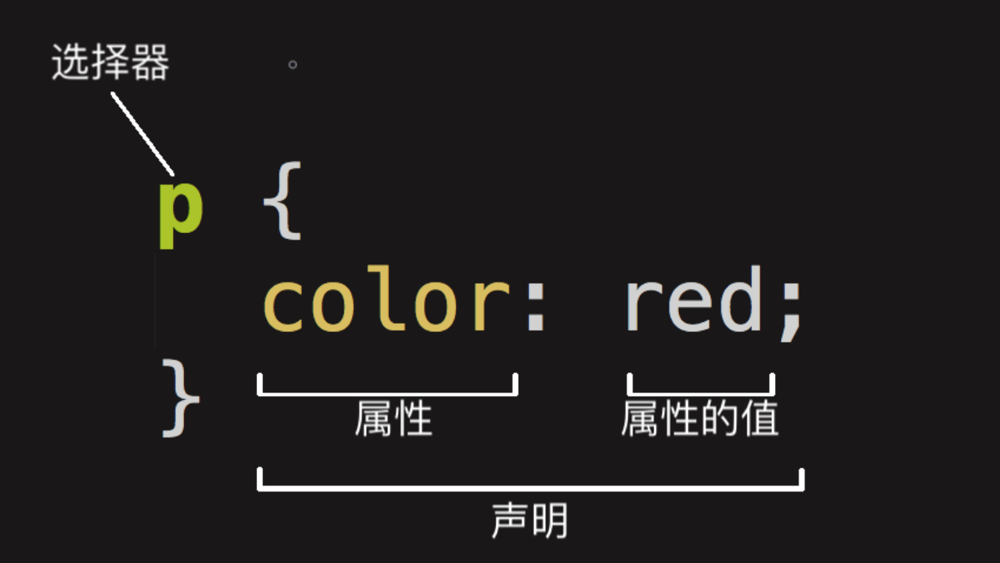

# CSS

整个结构称为*规则集*（通常简称“规则”），释义如下：

*选择器（Selector）*
选择器的种类信息请参阅 [选择器](https://developer.mozilla.org/zh-CN/docs/Learn/CSS/Introduction_to_CSS/Selectors) 
HTML 元素的名称位于规则集开始。它选择了一个或多个需要添加样式的元素（在这个例子中就是p元素）。要给不同元素添加样式只需要更改选择器就行了。

*声明（Declaration）*
一个单独的规则。如color: red;用来指定添加样式元素的*属性*。

*属性（Properties）*

改变 HTML 元素样式的途径。（本例中color就是 [
](https://developer.mozilla.org/zh-CN/docs/Web/HTML/Element/p) 元素的属性。）CSS 编写人员决定修改哪个属性以改变规则。

*属性的值（Property value）*
在属性的右边，冒号后面即*属性的值*，它从指定属性的众多外观中选择一个值（我们除了red之外还有很多属性值可以用于color）。

* 每个规则集（除了选择器的部分）都应该包含在成对的大括号里（{}）。
* 在每个声明里要用冒号（:）将属性与属性值分隔开。
* 在每个规则集里要用分号（;）将各个声明分隔开。

