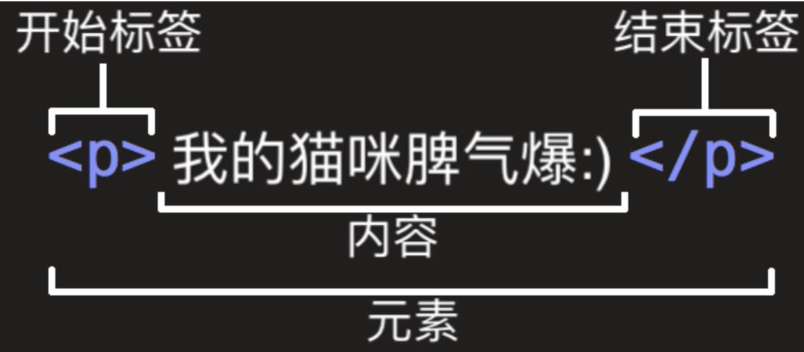
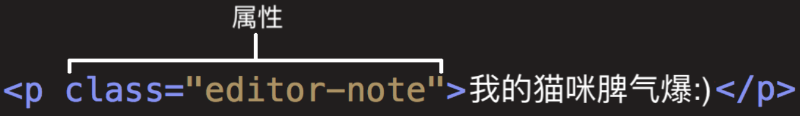

# HTML

HTML元素结构：

一个元素由开始标签-内容-结束标签组成。

属性：
一个元素可以有属性，Class是属性名，“editor-note”是属性的值。

元素嵌套：嵌套的元素顺序必须正确
正确：
我的猫咪脾气<strong>爆</strong>:)

错误：
我的猫咪脾气<strong>爆:)
</strong>

空元素：元素里没有内容（scr，alt为2个属性，属性间空格分开
