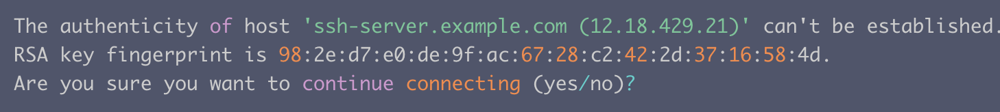

# SSH
#计算机网络/TCPIP

SSH是一种应用层协议标准，用于在网络主机之间进行加密的一种协议，其目的是实现**安全远程登录**以及其它**安全网络服务**。

# 原理：和Https类似
## SSH 中是如何解决中间人攻击的问题？
client自己基于口令自行认证（其实不安全）。因为SH 的 **Publish key**和 **Private key**都是自己生成的，没法向https那样通过CA公证。只能通过 Client 端自己对公钥进行确认，所以一般登录的时候有如下提示：

如果输入yes，则该 host 已被确认，并被追加到client上的文件 **known_hosts**中，然后就需要输入密码，接着再进行非对称加密的认证。

## SSH非对称加密认证流程

1. 远程 Server 收到 Client 端用户 TopGun 的登录请求，Server 把自己的公钥发给用户。
2. Client 使用这个公钥，将密码进行加密，发送给 Server端。
3. 远程 Server 用自己的私钥，解密登录密码，然后验证其合法性。
4. 若验证结果成功，给 Client 相应的响应。

## SSH免密码公钥登录认证流程

1. Client 将自己的公钥存放在 Server 上，追加在文件 authorized_keys 中。注意：Client 端的 Public key 是 Client 手动 Copy 到 Server端的，SSH 建立连接过程中没有公钥的交换操作。
2. Server 端接收到 Client 的连接请求后，会在 authorized_keys 中匹配到 Client 的公钥 pubKey，并生成随机数 R，用 Client 的公钥对该随机数进行加密得到 pubKey(R)，然后将加密后信息发送给 Client。
3. Client 端通过私钥进行解密得到随机数 R，然后对随机数 R 和本次会话的 SessionKey 利用 MD5 生成摘要 Digest1，发送给 Server 端。
4. Server 端会也会对 R 和 SessionKey 利用同样摘要算法生成 Digest2。
5. Server 端会最后比较 Digest1 和 Digest2 是否相同，完成认证过程。

## server如何知道client的公匙的？
在步骤1中，Client 将自己的公钥存放在 Server 上。需要用户手动将公钥 Copy 到 Server 上。这就是在配置 SSH 的时候进程进行的操作，比如github：

## Server 根据什么信息在 authorized_keys 中进行查找的呢？
在步骤 2 中，主要是根据 Client 在认证的开始会发送一个 KeyID 给 Server，这个 KeyID 会唯一对应该 Client 的一个 PublicKey，Server 就是通过该 KeyID 在 authorized_keys 进行查找对应的 PublicKey。

## SSH登录时相关文件解释

1. id_rsa：保存私钥
2. id_rsa.pub：保存公钥
3. authorized_keys：保存已授权的客户端公钥
4. known_hosts：保存已认证的远程主机 ID

> 一台主机可能既是 Client，也是 Server。所以会同时拥有authorized_keys 和 known_hosts。  

